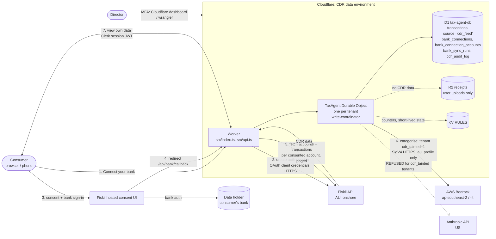

# CDR data environment (CDE)

> Schedule 2, cl 1.4 (define and document the boundary) and control 2(e) (segregation). Version 0.1,
> 2026-10-08. Schedule 2 defines the CDE as "the information technology systems used for, and processes
> that relate to, the management of CDR data". For Quillo, CDR data is **service data** under rule
> 1.10AA(5): CDR data Fiskil discloses to Quillo, **and anything directly or indirectly derived from it**.

## 1. Summary

- **Source:** Fiskil (accredited data recipient and Quillo's CDR representative principal), which collects
  from the consumer's bank (data holder) under a consent the consumer gives in **Fiskil's hosted consent
  UI**. Quillo never sees bank credentials.
- **Scope collected:** bank accounts and transactions only. No name, contact details, saved payees, or full
  account / BSB numbers (masked last 4 only).
- **Where it lives:** Cloudflare (Worker + Durable Object compute, D1 database) and, for inference, AWS
  Bedrock in Sydney/Melbourne. Nothing else.
- **Who can reach it:** the consumer (through the app, authenticated by Clerk) and the director (through
  the Cloudflare dashboard/API, with MFA). Nobody else.
- **State today (2026-10-08):** the bank feed is **sandbox only** and behind the `bank_feed_cdr` flag (OFF
  in production). No real consumer's CDR data has been collected.

## 2. Data flow

Steps: (1) the consumer starts a connection; (2) the Worker creates a Fiskil auth session and records
`consent_requested` in `cdr_audit_log`; (3) the consumer consents and authenticates at their bank inside
Fiskil's UI; (4) Fiskil redirects back with the session; (5) the Worker fetches accounts and transactions
for consented accounts only, stamps `profiles.cdr_tainted = 1` **before the first write**, and writes rows
through the tenant's Durable Object; (6) categorisation runs on Bedrock in Australia; any attempt to use
the US provider throws; (7) the consumer sees and manages their data and consents in the app.

Code: [`src/lib/fiskil.ts`](../../src/lib/fiskil.ts), [`src/lib/bank-provider.ts`](../../src/lib/bank-provider.ts),
[`src/lib/bank-connect.ts`](../../src/lib/bank-connect.ts), [`src/lib/bank-sync.ts`](../../src/lib/bank-sync.ts),
[`src/lib/bank-feed-core.ts`](../../src/lib/bank-feed-core.ts), [`src/lib/bank-consent.ts`](../../src/lib/bank-consent.ts),
[`src/llm.ts`](../../src/llm.ts) (`getLLM`), [`src/agent.ts`](../../src/agent.ts) (`markCdrTainted`).

## 3. What CDR data Quillo holds

| Data | Where | Classification | Notes |
|---|---|---|---|
| Bank transactions (date, amount, description/merchant, direction) | D1 `transactions` with `source='cdr_feed'`, `kind='bank_line'` | CDR — Restricted | Deleted on consent withdrawal (PS12); minimised after the year is lodged (#581) |
| Account metadata (provider account id, masked number last 4, name, type, currency, selected) | D1 `bank_connection_accounts` | CDR — Restricted | Full account number / BSB never read past the provider boundary |
| Connection and consent metadata (Fiskil end-user id, connection id, consent id, institution, scope, granted/expiry/revoked timestamps) | D1 `bank_connections`, `profiles.bank_provider_user_id` | CDR — Restricted (identifiers) | Needed for consent management and deletion |
| Sync runs (window, counts, status, provider error id) | D1 `bank_sync_runs` | CDR metadata — Confidential | No transaction content |
| CDR audit trail (event, ids, counts, windows, error class) | D1 `cdr_audit_log` | Audit record — Confidential | **No CDR content**; kept after purge as evidence of deletion |
| **Derived data**: categories, claim suggestions, corrections, attributions, "we noticed" signals, receipt-match decisions, model inputs/outputs in `traces`, chat messages that quote a transaction, tax-position figures | D1 (`claim_suggestions`, `corrections`, `transaction_attributions`, `noticed_signals`, `reconcile_dismissals`, `traces`, `chat_messages`, `ai_edits`) | CDR — Restricted (service data, r1.10AA(5)(b)) | This is why the `cdr_tainted` flag is a property of the **tenant**, not of each row: derived data is CDR data too, and it is never cleared |
| Short-lived caches | KV `RULES` (e.g. `guide:*`, 30-minute TTL; OAuth/consent `state` keys, 10 minutes) | Confidential | No transaction lists are cached; guide text may be derived from the situation profile |

Not held: bank credentials, full account numbers, BSBs, names or contact details from the bank, payees,
direct debits, balances history beyond what transactions carry, or any ability to initiate payments.

## 4. Boundary

**Inside the CDE** (systems that store, process or can access CDR data):

| Component | Role | Operator / location |
|---|---|---|
| Cloudflare Worker `tax-agent` | API, bank connect/callback/sync, SPA serving | Cloudflare, global edge (request runs at the nearest PoP) |
| `TaxAgent` Durable Object | Per-tenant write coordinator | Cloudflare (location chosen by Cloudflare; `locationHint: "oc"` is a latency hint, **not** a residency guarantee) |
| D1 `tax-agent-db` | System of record | Cloudflare (primary location set by Cloudflare when the database was created; **not** guaranteed to be in Australia — confirm the region in the dashboard and record it here) |
| Workers Logs (observability) | Runtime logs | Cloudflare. Rule: ids and error classes only, never CDR content (#634 removes remaining PII) |
| D1 backups (planned R2 bucket) | Daily export | Cloudflare R2 (#635) |
| AWS Bedrock (`au.` inference profile) | Categorisation and other model calls for CDR-tainted tenants | AWS ap-southeast-2 / ap-southeast-4 |
| Fiskil API and hosted consent UI | Collection, consent | Fiskil (Australia). The principal, not an OSP of Quillo |
| Clerk | Authenticates the consumer before any CDR data is shown | Clerk (US). Holds identity only; never receives CDR data |
| The director's laptop and accounts (Cloudflare, GitHub, AWS, Fiskil Console) | Administrative access | Owner's home office, Australia. **Must not store CDR data** |
| The SPA in the consumer's browser | Displays the consumer's own data | Consumer device (outside our control; consumer access is excluded from 1(a)) |

**Outside the CDE** (must never receive CDR data): Anthropic API (refused for CDR-tainted tenants),
Stripe, Intuit QuickBooks (the canonical-source rule keeps feed accounts and QBO separate; QBO is a
reader/reconciler and never receives feed lines), Google Places, Frankfurter, Google Fonts, Unsplash,
Cloudflare Email Routing (inbound receipt email), GitHub (code only, no data), the local dev environment
and any preview deployment (sandbox data only).

**Known boundary weakness to keep honest:** R2 receipts and D1 are in the same Cloudflare account and the
same Worker can reach both. Segregation inside D1 is logical (tenant + source), not physical. This is the
normal multi-tenant model and is backed by tests, but it is listed so a reviewer can judge it.

## 5. Network boundary

- The only inbound path is HTTPS to `app.quillo.au` (and `tax-agent.<account>.workers.dev`, to be
  restricted), terminated at Cloudflare's edge with DDoS protection. There are no servers, SSH, VPN or open
  database ports.
- D1, R2, KV and the Durable Object are reachable only via Worker bindings or the Cloudflare API with an
  authenticated account (director, MFA) or a scoped API token.
- Outbound calls from the Worker to CDR-relevant hosts: `api.fiskil.com`, `bedrock-runtime.ap-southeast-{2,4}.amazonaws.com`.
- Browser: Content Security Policy restricts scripts, frames and connections to self, Clerk, Cloudflare
  Turnstile and Google Fonts ([`src/index.ts`](../../src/index.ts); enforcing mode in #634).

## 6. Segregation

Control 2(e) requires CDR data held for a representative to be accessible only by the right recipient
and attributable to it. Quillo's mechanisms:

1. **Per-consumer isolation.** Every table carries `user_id`; identity comes from a verified Clerk
   session, never a client header; each tenant has its own Durable Object. Persona, e2e and unit tests
   exercise tenant scoping.
2. **CDR rows are marked.** Feed lines carry `source='cdr_feed'` and `kind='bank_line'`; the account they
   feed is `source='cdr_feed'`. `assertCanonicalSource` ([`src/lib/queries.ts`](../../src/lib/queries.ts))
   refuses mixing a feed with a statement or QBO on one account, so CDR lines are never merged into
   another source.
3. **Attributable to the consent and the principal.** Every connection row records `provider`
   (`fiskil`), the Fiskil end-user, connection and consent ids, and the consent window, so each line can
   be traced to the consent under which Fiskil disclosed it.
4. **Tenant-level taint.** `profiles.cdr_tainted` is set to 1 before the first CDR write and is **never
   cleared** (migration 0077). It drives the AU-only inference rule for everything derived from the data.
5. **Sandbox separation.** Real vs. synthetic is decided by `requiresAuResidency`: Fiskil data is treated
   as real unless the environment is sandbox **and** the institution is Fiskil's sandbox data holder
   (`88888`). An unknown provider or institution is treated as real (fail closed).
6. **Deletion targets only CDR rows.** PS12 deletes `source='cdr_feed' AND kind='bank_line'` and never
   touches statement, QBO or manual rows.

## 7. Boundary review log

Review annually (October) and as soon as practicable after a material change (cl 1.4(2)): a new data
type requested from Fiskil, a new OSP, a new place CDR-derived data is written, a new inference provider,
or a change to the Cloudflare/AWS setup.

| Date | Reviewer | Change found | Action |
|---|---|---|---|
| 2026-10-08 | Drafted (#642) | Initial boundary | Director to confirm |
| | | | |
